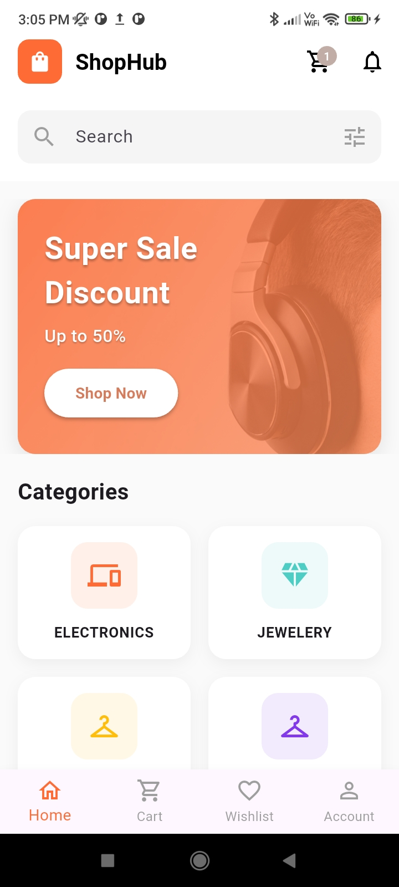

# ShopHub 🛍️



> A full-featured e-commerce mobile app built with Flutter — browse products, manage your cart, apply discount codes, and checkout with ease.

**Contributions welcome!** See [CONTRIBUTING.md](CONTRIBUTING.md) to get started.

---

## ✨ Features

- **Splash Screen** — Animated logo on launch
- **Login Screen** — Email & password validation (no backend required)
- **Dashboard** — Promotional banners + category grid
- **Product Listing** — Browse by category with search support
- **Product Details** — Full product info, ratings, and Add to Cart
- **Wishlist** — Save products for later
- **Shopping Cart** — Add, remove, increment/decrement quantities
- **Discount Codes** — Apply promo codes (`SAVE10`, `SAVE20`, `WELCOME`, `SUMMER`)
- **Checkout** — Delivery address and phone number collection
- **Payment Screen** — Choose from Card, Digital Wallet, or UPI
- **Order Confirmation** — Order ID, delivery date, and status timeline
- **Account Screen** — Edit profile, manage addresses, payment methods, view orders, help & support
- **State Management** — Provider-based cart, wishlist, and user state

---

## 📋 Prerequisites

| Requirement | Version |
|-------------|---------|
| Flutter SDK | ≥ 3.0.0 |
| Dart SDK | ≥ 3.0.0 |
| Android Studio **or** VS Code | Latest |
| Android Emulator or Physical Device | API 21+ |

---

## 🚀 Getting Started

### 1. Clone the repository

```bash
git clone git clone https://github.com/survesufiyan/shophub.git
cd shophub
```

### 2. Install dependencies

```bash
flutter pub get
```

### 3. Run the app

```bash
# On a connected device or emulator
flutter run

# For a specific platform
flutter run -d android
flutter run -d ios
```

### 4. Build a release APK (optional)

```bash
flutter build apk --release
```

The output APK will be at `build/app/outputs/flutter-apk/app-release.apk`.

---

## 🔑 Test Credentials

The login screen accepts any valid email + password (≥ 6 characters). No backend is required.

```
Email:    test@example.com
Password: password123
```

### Valid Discount Codes

| Code | Discount | Condition |
|------|----------|-----------|
| `SAVE10` | 10% off | Any order |
| `SAVE20` | 20% off | Orders over $50 |
| `WELCOME` | 15% off | New customers |
| `SUMMER` | 25% off | Summer special |

---

## 📁 Project Structure

```
lib/
├── main.dart                          # App entry point, providers setup
│
├── models/
│   ├── product.dart                   # Product data model
│   ├── cart_item.dart                 # Cart item model
│   └── wishlist_item.dart             # Wishlist item model
│
├── providers/
│   ├── cart_provider.dart             # Cart state (add, remove, discount)
│   ├── wishlist_provider.dart         # Wishlist state
│   └── user_provider.dart             # User profile state
│
├── services/
│   └── api_service.dart               # Fake Store API calls
│
└── screens/
    ├── splash_screen.dart             # Animated launch screen
    ├── login_screen.dart              # Auth form with validation
    ├── main_navigation_screen.dart    # Bottom nav shell
    ├── dashboard_screen.dart          # Home: banners + categories
    ├── product_list_screen.dart       # Products by category
    ├── product_details_screen.dart    # Single product view
    ├── search_results_screen.dart     # Search results
    ├── cart_screen.dart               # Cart + discount code
    ├── checkout_screen.dart           # Address & phone form
    ├── payment_screen.dart            # Payment method picker
    ├── order_confirmation_screen.dart # Success screen + order timeline
    └── account/
        ├── account_screen.dart        # Profile + settings hub
        ├── edit_profile_screen.dart   # Update name, email, phone
        ├── addresses_screen.dart      # Add/edit/delete addresses
        ├── payment_methods_screen.dart# Saved card management
        ├── orders_screen.dart         # Order history
        └── help_support_screen.dart   # FAQ + contact form
```

---

## 🌐 API Reference

This app uses the [Fake Store API](https://fakestoreapi.com) — no API key required.

| Endpoint | Description |
|----------|-------------|
| `GET /products/categories` | Fetch all categories |
| `GET /products/category/{category}` | Products in a category |
| `GET /products/{id}` | Single product detail |
| `GET /products?limit=5` | Featured / recent products |

---

## 📦 Dependencies

```yaml
dependencies:
  flutter:
    sdk: flutter
  provider: ^6.0.5              # State management
  http: ^1.1.0                  # REST API calls
  cached_network_image: ^3.3.0  # Efficient image loading & caching
  shimmer: ^3.0.0               # Skeleton loading animations
```

---

## 🗒️ Notes

- **Authentication** is simulated — any valid email + 6-char password works
- **Cart and wishlist** data is stored in memory (cleared on app restart)
- **User profile** edits persist only for the current session
- **Product images** are cached automatically via `cached_network_image`
- The app accent color is `#FF6B35` (orange) throughout

---

## 📸 App Screens

| Screen | Description |
|--------|-------------|
| Splash | Animated ShopHub logo |
| Login | Validated email/password form |
| Dashboard | Promo banners + 4 category tiles |
| Product List | Scrollable grid with shimmer loading |
| Product Detail | Image, price, rating, add to cart |
| Cart | Items list, quantity controls, discount code |
| Checkout | Address + phone with form validation |
| Payment | Card / Wallet / UPI selector |
| Order Confirmed | Order ID, total, delivery date, status timeline |
| Account | Profile, addresses, cards, orders, help |

---

## 🤝 Contributing

We welcome contributions of all kinds! Here's how to get involved:

1. **Fork** the repository
2. **Create a branch** — `git checkout -b feature/your-feature-name`
3. **Make your changes** and run `flutter analyze`
4. **Commit** — `git commit -m "feat: describe your change"`
5. **Push** — `git push origin feature/your-feature-name`
6. **Open a Pull Request** against `main`

Read the full guide in [CONTRIBUTING.md](CONTRIBUTING.md) before submitting.

### 🏷️ Good First Issues

| Issue | Difficulty |
|-------|------------|
| Add shimmer loading to cart screen | Easy |
| Add product rating stars to product card | Easy |
| Add product search with real-time filtering | Medium |
| Persist cart data using SharedPreferences | Medium |
| Write widget tests for CartProvider | Medium |
| Add dark mode support | Hard |

---

## ⚙️ GitHub Repo Setup

### Recommended Settings (Settings tab on GitHub)

**General**
- ✅ Issues — enabled
- ✅ Projects — enabled
- ✅ Allow squash merging
- ❌ Allow merge commits — disable
- ❌ Allow rebase merging — disable

**Branch Protection** (Settings → Branches → Add rule for `main`)
- ✅ Require a pull request before merging
- ✅ Require at least 1 approval
- ✅ Dismiss stale reviews when new commits are pushed

### Repo Topics

Add these in the GitHub **About** section (gear icon) to improve discoverability:

```
flutter  dart  ecommerce  mobile  android  ios  provider  fake-store-api  open-source  hacktoberfest
```

> Adding `hacktoberfest` lists your repo automatically during Hacktoberfest in October — great for attracting contributors.

---

## 📂 Repository Structure

```
shophub/
├── .github/
│   ├── ISSUE_TEMPLATE/
│   │   ├── bug_report.md
│   │   └── feature_request.md
│   └── PULL_REQUEST_TEMPLATE.md
├── lib/                    ← Flutter source code
├── CONTRIBUTING.md
├── README.md
└── pubspec.yaml
```

---

## 📄 License

This project is for educational/demo purposes using publicly available data from [fakestoreapi.com](https://fakestoreapi.com).